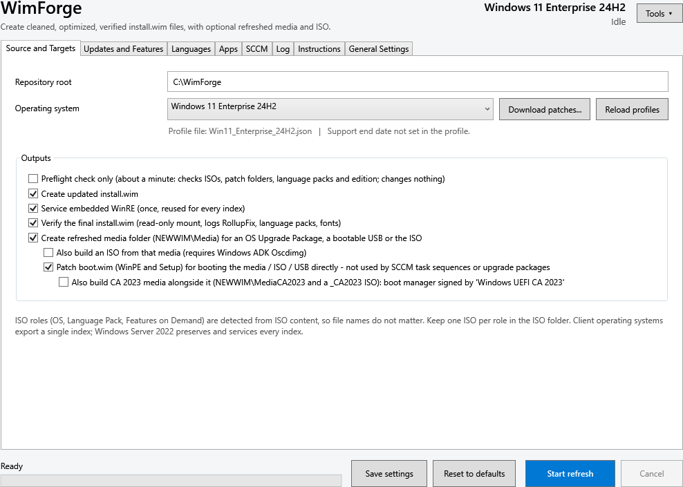
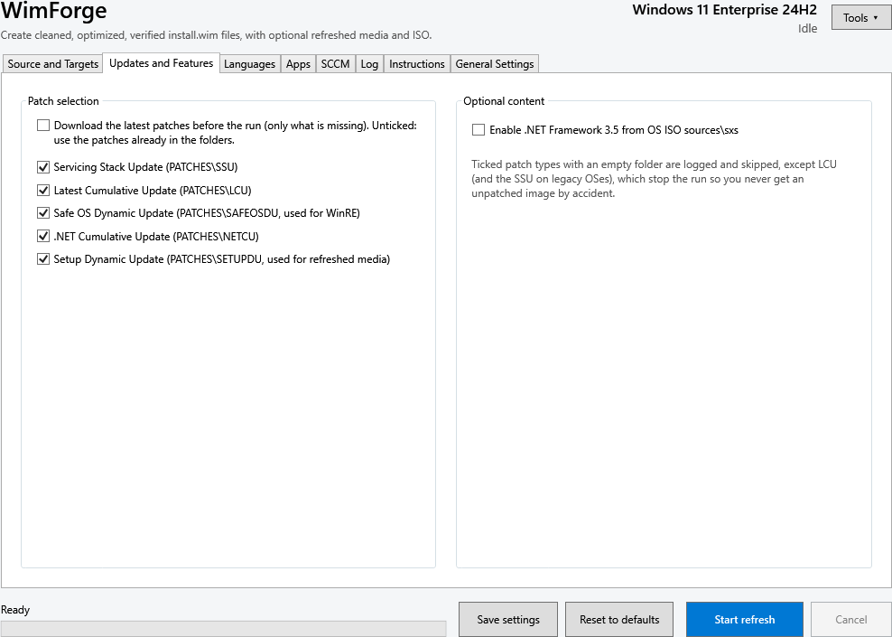
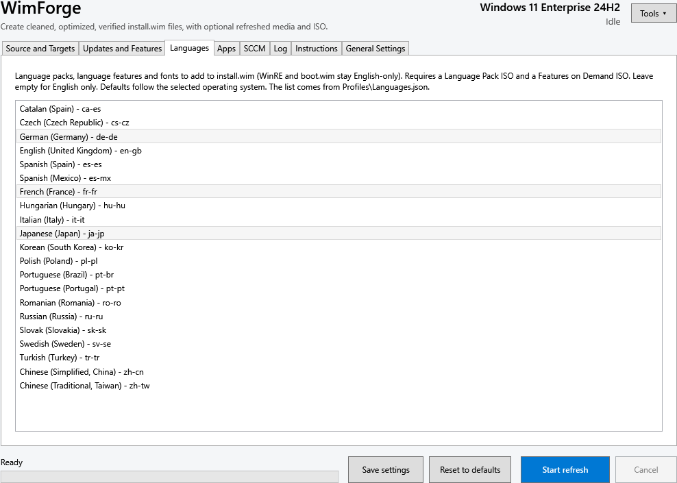
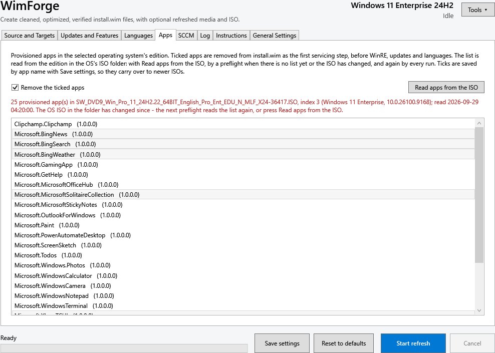
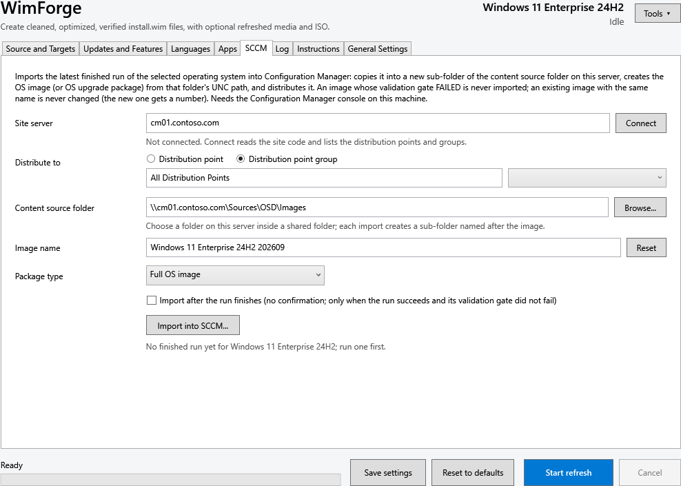
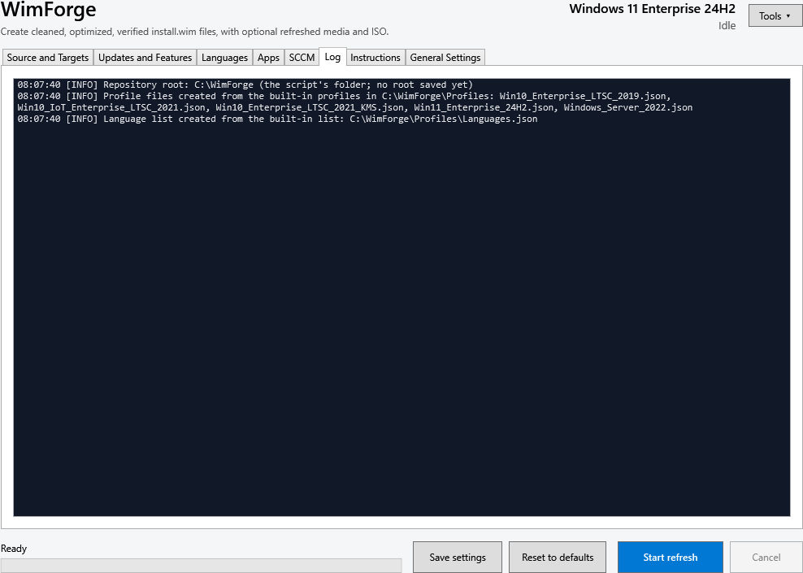
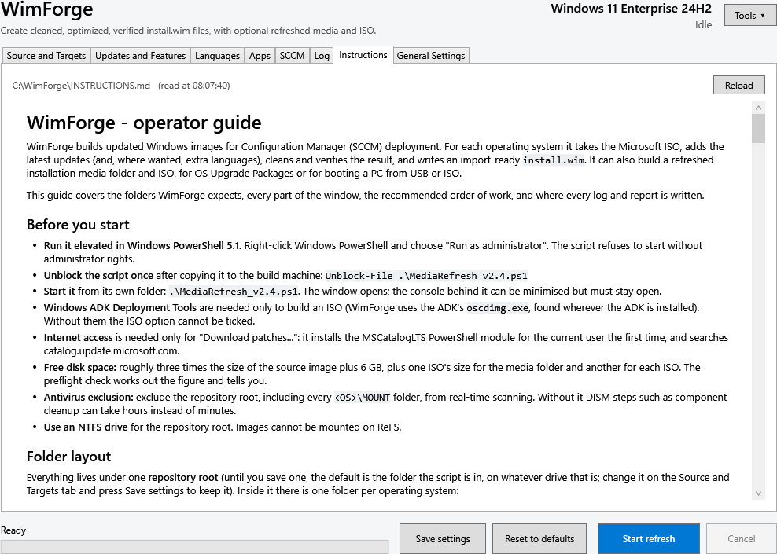
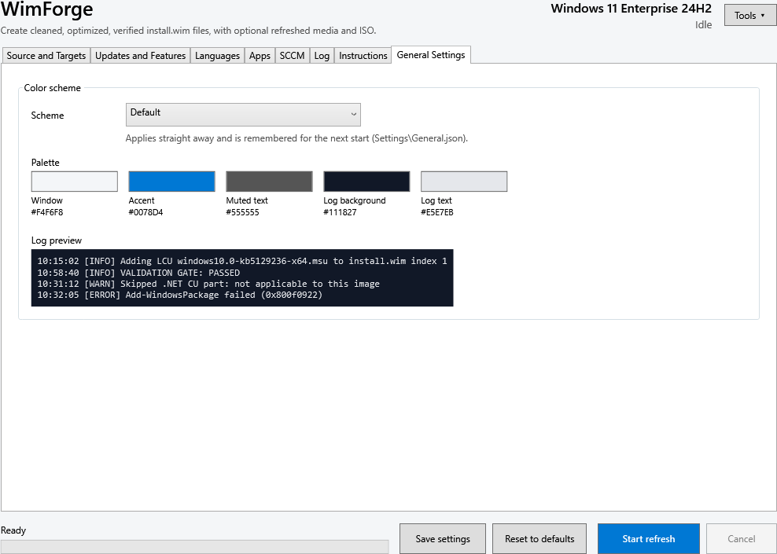
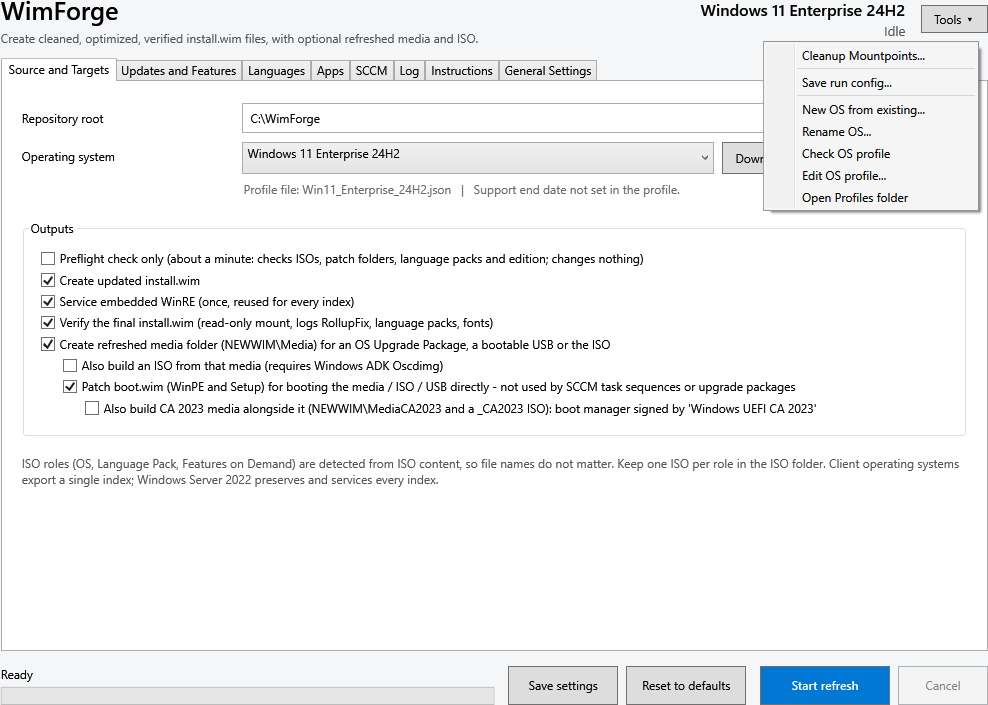

# WimForge

WimForge automates adding cumulative patches, language packs, and Features on Demand to
Windows OS media (Windows 11, Windows 10 LTSC, Windows Server 2022, and
others) as an offline DISM servicing step, ahead of importing the refreshed
images into SCCM/Configuration Manager for deployment.

Inspired by other great tools, like WimWizard, WimWitch. While amazing in their own rights,
I needed something that could patch older operating systems along with new OS versions.
While this tool is tailored to specific OS versions, including older LTSC versions,
it can be easily modified to accommodate any modern OS version.

The tool is a single-file PowerShell 5.1 WPF GUI application: mount an OS ISO
(plus optional Language Pack / Features on Demand ISOs), apply the SSU/LCU/
language packs/.NET CU in Microsoft's documented order, verify the result,
and optionally build a refreshed media folder and ISO for OS Upgrade
Packages. It can also download the current LCU, .NET CU, Safe OS and Setup
Dynamic Updates from the Microsoft Update Catalog (via the MSCatalogLTS
module), with a dry-run preview before anything is downloaded.

## Screenshots

**Source and Targets** - the OS, the repository root, and what to build (install.wim, WinRE, media folder, ISO, boot.wim, CA 2023 media).

**Updates and Features** - which update classes to apply, .NET Framework 3.5, and "Download the latest patches before the run".

**Languages** - the language packs and Features on Demand to add to install.wim.

**Apps** - the provisioned apps read from the ISO; ticked apps are removed first.

**SCCM** - import the finished image or upgrade package into Configuration Manager and distribute it.

**Log** - the run's log, coloured by level.

**Instructions** - the operator guide (`INSTRUCTIONS.md`), formatted.

**General Settings** - colour schemes.

**Tools menu** - Cleanup Mountpoints, run configs for the command line, and adding, renaming, checking and editing OS profiles.

## Files

- `MediaRefresh_v2.4.ps1` — the current script and the only one under
  development and test. A complete, standalone script (no shared modules).
- `TODO.md` — the project's living task list: what is being validated now,
  the open decisions and the feature backlog (open items only).
- `TODO_DONE.md` — completed work moved out of `TODO.md`: build details,
  confirmed checks, what v2.4 already contains, and the project history.
- `testkit/` — a mock-based PowerShell test kit (unit tests, end-to-end
  scenario tests, XAML/parse/lint checks). It tests `MediaRefresh_v2.4.ps1`
  by default; set `$env:MR_SCRIPT` to test another copy. See
  `testkit/README_TESTKIT.md`.
- `MediaRefresh_Review_and_Roadmap.md` — the original code review and
  roadmap that this project's plan grew out of (section 0 has the real-image
  test plan).
- `archive/` — earlier versions (`v2_original`, `v2.1`–`v2.3`) and old notes,
  kept for history only. v2.4 contains everything they had.

## Status

v2.4 is being validated (see `TODO.md` step 2). It passes the mock test kit
(668 checks, on Windows PowerShell 5.1 and 7) and every built-in catalog
rule has been checked against the live Microsoft Update Catalog. Windows 11 24H2
(three times, English only), Windows 11 26H2 (install.wim), LTSC 2019 (ten
languages) and LTSC 2021 KMS (four languages) have been serviced on real
images, with the install.wim validation gate passing each time; IoT LTSC 2021
and Server 2022 are still to be run. Treat it as a draft and test on
non-production images first.

## Requirements

Windows PowerShell 5.1, run elevated, on a machine with the DISM module and
enough free disk space per profile (30 GB client / 60 GB Server minimum).
"Download patches..." needs internet access and installs the MSCatalogLTS
module from the PowerShell Gallery on first use.
See `TODO.md` and the in-script header comments for the expected working
folder layout (`ISO`, `LOGS`, `MOUNT`, `OLDWIM`, `NEWWIM`, `PATCHES`, `TEMP`,
`WINPE`, `WINRE`, `WORKING` per OS).
